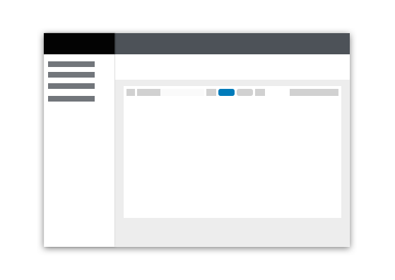
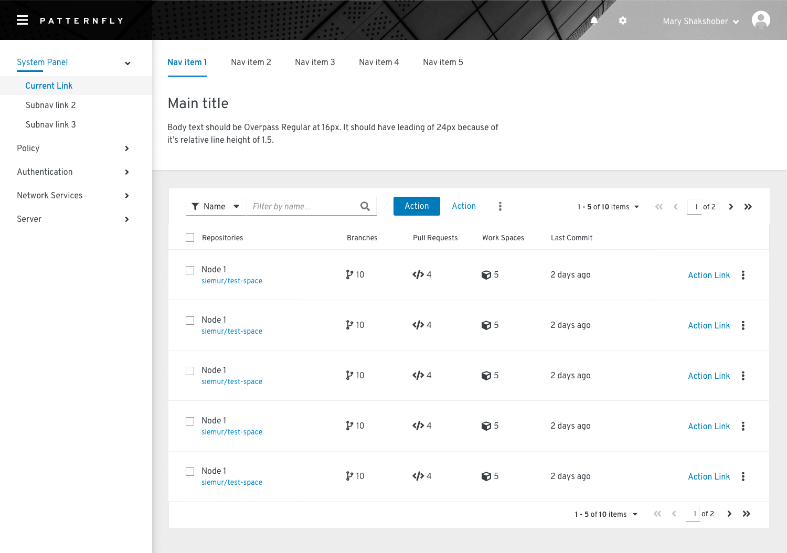

# Toolbar
The toolbar contains multiple components that allow a user to manage and manipulate a data set. Data can be presented in a variety of views (table, list, card, etc.). PatternFly supports multiple toolbar variations that address a variety of use cases.

## Elements

The following elements can be included in a typical toolbar.
1. **Bulk selection (optional)**: Bulk selection can be added when the functionality isn't available from the component you're using to present the data. For example, you might need to include a bulk selector for a card view or data list, but a table will enable bulk selection by default. Besides allowing the user to select and deselect all items on a page, other application specific options can be added in the dropdown. Bulk selection allows the user to select or deselect all items on a page and provide an indeterminate state that notifies the user when only some items are selected. Bulk selectors should always be the left-most element in a toolbar. When providing a bulk selector in a list view, it should be aligned with the checkboxes.
2. **Filters**: PatternFly supports a variety of common filter types that can be used alone or in combination to construct a custom filter.
3. **Sort (optional)**: A sort component may to added when this functionality is needed. Tables have built in sorting, but card views and data lists may require toolbar sorting.
4. **Global actions**: Any global actions that apply to selected data items are included left-aligned following filter and sort controls. These may be exposed as buttons or collapsed into a kabob menu. No more than two items should be exposed as buttons. Button labels should be limited in length to preserve horizontal space.
5. **Pagination**: When pagination is supported, a pagination component will be included. Pagination will always be right aligned in the toolbar.

## Usage
### When to use
Toolbars enable users to manipulate data in views where built-in controls aren't already available, like list views or card views. You can choose from multiple toolbar variations to suit your use case, and further customize your toolbar using any of the components listed under [Related components and demos](#related-components-and-demos).

### When not to use
Don't provide a toolbar for any data view that already includes the controls needed to manipulate a given data.

### Layout considerations

The toolbar should appear below the page title, if one exists. It should always appear above the data set to which it applies. Toolbars should stretch to the width of the data view to which it applies, with the elements aligned as specified below. When filters are applied, the toolbar will expand in height to make space for a row of filter chips. Upon clearing the applied filters, the toolbar will collapse to it’s default height.

Within the toolbar, layouts may vary depending on the use case. When used, bulk selection should be the left-most element. Filters and global actions may follow. When pagination is used it should be the right-most element. When pagination is not used, the item count should be the right-most element.

## Variations
**Basic toolbar**

The basic toolbar is sufficient for most cases. It includes filters, global actions, and item count. The Toolbar is shown here with an Attribute-Value (textbox) filter, but a variety of filter types may be used.
1. **Item count**: When a filter is applied, the item count will be updated to represent the filtered subset of items. For example, “10 of 17 items.” The item count should be the right-most element.

**Toolbar with pagination**

When pagination is needed, a pagination component can be used.
1. **Pagination**: When pagination is used, the pagination component replaces the item count. It should be the right-most element.

**Toolbar with filter chips**

When the current settings of the controls are not sufficient to convey applied filters, filter chips should be used.
1. **Filter chips**: When filters are applied the toolbar will expand and filter chips will be displayed on the second row. Users can clear all filters by clicking the “Clear filters” link, and the toolbar will collapse back into one row.

**Custom toolbar**

Custom toolbars can vary by use case. In the above example, the toolbar is primarily comprised of filters.

## Examples
**Toolbar in data table**

**Toolbar in data list**

**Responsive toolbar**

The toolbar adapts to smaller viewport sizes by collapsing or hiding elements that take significant space, including filters and actions. On mobile devices, when used, pagination will be available from the footer, only.

## Related components and demos
**Core HTML/CSS**
* [Badges](/documentation/core/components/badge)
* [Buttons](/documentation/core/components/button)
* [Chip](/documentation/core/components/chip)
* [Chip group](/documentation/core/components/chipgroup)
* [Dropdowns](/documentation/core/components/dropdown)
* [Input group](/documentation/core/components/inputgroup)
* [Options Menus](/documentation/core/components/optionsmenu)
* [Pagination](/documentation/core/components/pagination)
* [Select](/documentation/core/components/select)

**React**
* [Badges](/documentation/react/components/badge)
* [Buttons](/documentation/react/components/button)
* [Chip](/documentation/react/components/chip)
* [Dropdowns](/documentation/react/components/dropdown)
* [Toolbar demo](/documentation/react/demos/toolbar)
